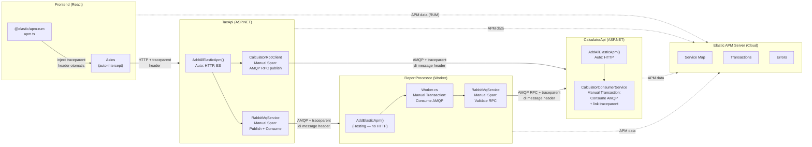
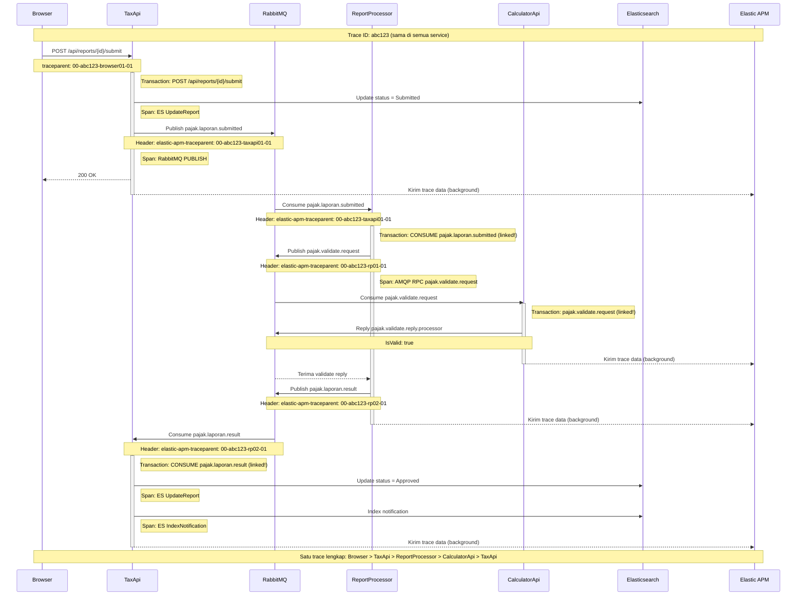
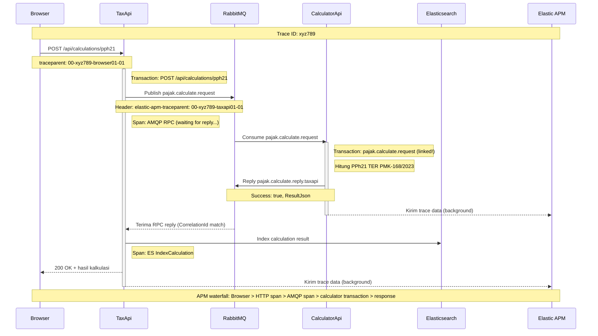

# Instrumentasi Elastic APM - Demo Aplikasi Pajak

Dokumen ini menjelaskan cara keseluruhan aplikasi diinstrumentasi dengan **Elastic APM** untuk distributed tracing end-to-end: dari klik di browser hingga kalkulasi pajak di microservice, melewati RabbitMQ.

---

## Daftar Isi

1. [Konsep Dasar](#1-konsep-dasar)
2. [Package & Dependensi](#2-package--dependensi)
3. [Konfigurasi Environment](#3-konfigurasi-environment)
4. [Frontend APM RUM Agent](#4-frontend--apm-rum-agent)
5. [TaxApi Auto-instrument + Custom Span](#5-taxapi--auto-instrument--custom-span)
6. [CalculatorApi Trace dari Header AMQP](#6-calculatorapi--trace-dari-header-amqp)
7. [ReportProcessor Worker Service Tracing](#7-reportprocessor--worker-service-tracing)
8. [Propagasi Traceparent via RabbitMQ](#8-propagasi-traceparent-via-rabbitmq)
9. [Diagram Instrumentasi](#9-diagram-instrumentasi)

---

## 1. Konsep Dasar

Elastic APM mendukung **distributed tracing** menggunakan standar [W3C Trace Context](https://www.w3.org/TR/trace-context/).
Setiap request diberi satu `trace-id` unik. Saat melintas antar service (HTTP, message queue), konteks ini diteruskan via header `traceparent`.

```
traceparent: 00-<trace-id>-<parent-id>-01
              │   16 bytes   8 bytes   flags
              └─ versi W3C
```

Tiga komponen utama:

| Istilah         | Artinya                                                              |
|-----------------|----------------------------------------------------------------------|
| **Transaction** | Unit kerja utama satu service (misal: handle HTTP request, consume 1 pesan) |
| **Span**        | Sub-operasi dalam transaction (misal: query ES, publish ke queue)    |
| **Traceparent** | Header string yang membawa trace-id dari service pengirim ke penerima |

---

## 2. Package & Dependensi

### Backend (.NET 9)

```xml
<!-- TaxApi.csproj & CalculatorApi.csproj -->
<PackageReference Include="Elastic.Apm.NetCoreAll" Version="1.34.1" />

<!-- ReportProcessor.csproj (Worker Service — tidak ada HTTP pipeline) -->
<PackageReference Include="Elastic.Apm.Extensions.Hosting" Version="1.34.1" />
```

Perbedaan:

| Package                         | Digunakan untuk                          | Yang di-auto-instrument                    |
|---------------------------------|------------------------------------------|--------------------------------------------|
| `Elastic.Apm.NetCoreAll`        | ASP.NET Core (ada HTTP pipeline)         | HTTP requests, Elasticsearch, SQL, dsb.    |
| `Elastic.Apm.Extensions.Hosting`| Worker Service (tidak ada HTTP pipeline) | Hanya DI hosting — transaction harus manual|

### Frontend (React + TypeScript)

```json
// package.json
"@elastic/apm-rum": "^5.17.4",
"@elastic/apm-rum-react": "^2.0.10"
```

---

## 3. Konfigurasi Environment

Semua konfigurasi APM di-inject via environment variable (Docker Compose), **tidak hardcode** di kode.

### Backend (docker-compose.yml)

```yaml
environment:
  - ElasticApm__ServiceName=pajak-taxapi          # Nama service di APM UI
  - ElasticApm__SecretToken=<secret_token>         # Autentikasi ke APM Server
  - ElasticApm__ServerUrl=https://<apm-server>:443 # APM Server endpoint
  - ElasticApm__Environment=development            # Label environment
  - ElasticApm__LogLevel=Error                     # Log internal APM agent
```

Konvensi .NET: `ElasticApm__ServiceName` → `ElasticApm:ServiceName` di `IConfiguration`.

### Frontend (build args Vite env vars)

```yaml
# docker-compose.yml — build args karena Vite bake env var saat build, bukan runtime
build:
  args:
    - VITE_ELASTIC_APM_SERVER_URL=https://<apm-server>:443
    - VITE_ELASTIC_APM_SECRET_TOKEN=<secret_token>
    - VITE_API_URL=http://<host>:5002
```

```dockerfile
# frontend/Dockerfile
ARG VITE_ELASTIC_APM_SERVER_URL
ARG VITE_ELASTIC_APM_SECRET_TOKEN
ARG VITE_API_URL
ENV VITE_ELASTIC_APM_SERVER_URL=$VITE_ELASTIC_APM_SERVER_URL
ENV VITE_ELASTIC_APM_SECRET_TOKEN=$VITE_ELASTIC_APM_SECRET_TOKEN
ENV VITE_API_URL=$VITE_API_URL
RUN npm run build
```

> **Kenapa build args?** `import.meta.env.VITE_*` di-replace secara literal saat `npm run build`.
> Environment variable runtime tidak dibaca oleh Vite di browser.

---

## 4. Frontend APM RUM Agent

### Inisialisasi (src/apm.ts)

```typescript
// src/apm.ts — HARUS diimport sebelum semua module lain
import { init as apmInit } from '@elastic/apm-rum';

export const apm = apmInit({
  serviceName: 'pajak-frontend',
  serverUrl: import.meta.env.VITE_ELASTIC_APM_SERVER_URL,
  secretToken: import.meta.env.VITE_ELASTIC_APM_SECRET_TOKEN,
  environment: 'development',

  // Inject header traceparent ke request Axios menuju TaxApi
  distributedTracingOrigins: [
    import.meta.env.VITE_API_URL ?? 'http://localhost:5001',
  ],

  // Nonaktif otomatis jika env var tidak diset
  active: !!import.meta.env.VITE_ELASTIC_APM_SERVER_URL,
});
```

```typescript
// src/main.tsx — import apm PERTAMA sebelum React
import './apm';   // ← harus baris pertama
import { StrictMode } from 'react';
import { createRoot } from 'react-dom/client';
import App from './App.tsx';

createRoot(document.getElementById('root')!).render(
  <StrictMode><App /></StrictMode>
);
```

### Apa yang di-capture otomatis?

| Event                              | Transaction/Span             |
|------------------------------------|------------------------------|
| Load halaman pertama               | Transaction: `page-load`     |
| Navigasi antar halaman (SPA)       | Transaction: `route-change`  |
| Axios request ke TaxApi            | Span: `XMLHttpRequest` + inject `traceparent` header otomatis |
| Error JavaScript yang tidak dihandle | Captured sebagai error       |

Karena `distributedTracingOrigins` diset ke URL TaxApi, setiap request Axios akan membawa header:
```
traceparent: 00-<trace-id>-<browser-span-id>-01
```
Sehingga trace dari browser terhubung langsung dengan transaction di TaxApi.

---

## 5. TaxApi Auto-instrument + Custom Span

### Registrasi (Program.cs)

```csharp
var builder = WebApplication.CreateBuilder(args);

// Satu baris ini mengaktifkan semua auto-instrumentation:
// - Setiap HTTP request masuk = 1 Transaction
// - Elasticsearch queries = Span otomatis
// - HttpClient keluar = Span otomatis
builder.Services.AddAllElasticApm();
```

### Custom Span: AMQP RPC ke CalculatorApi (TaxCalculatorService.cs)

Saat kalkulasi diminta, TaxApi tidak memanggil HTTP tapi publish ke RabbitMQ.
Karena ini tidak di-auto-instrument, span dibuat manual:

```csharp
using Elastic.Apm;
using Elastic.Apm.Api;

public async Task<TResponse> CallAsync<TRequest, TResponse>(string calculationType, TRequest request)
{
    var correlationId = Guid.NewGuid().ToString();

    // Ambil transaction aktif dari HTTP request yang sedang berjalan
    var currentTransaction = Agent.Tracer.CurrentTransaction;

    async Task PublishAction(ISpan? span)
    {
        // Ambil traceparent dari span/transaction saat ini untuk diteruskan ke CalculatorApi
        var traceparent =
            span?.OutgoingDistributedTracingData?.SerializeToString()
            ?? currentTransaction?.OutgoingDistributedTracingData?.SerializeToString();

        var props = new BasicProperties
        {
            CorrelationId = correlationId,
            ReplyTo = ReplyQueue,
            Headers = new Dictionary<string, object?>
            {
                // Kirim traceparent dalam header pesan RabbitMQ
                { "elastic-apm-traceparent", Encoding.UTF8.GetBytes(traceparent ?? "") }
            }
        };

        await _channel.BasicPublishAsync("", RequestQueue, false, props, body);

        // Tambahkan label custom ke span untuk filtering di APM UI
        span?.SetLabel("calculation_type", calculationType);
        span?.SetLabel("correlation_id", correlationId);
    }

    // Buat child span di dalam transaction HTTP yang aktif
    if (currentTransaction is not null)
    {
        await currentTransaction.CaptureSpan(
            "AMQP RPC pajak.calculate.request",
            ApiConstants.TypeMessaging,   // Type "messaging" tampil sebagai ikon queue di APM UI
            async (span) => await PublishAction(span));
    }

    // Tunggu balasan via RPC (10 detik timeout)
    var replyJson = await tcs.Task;
    return JsonSerializer.Deserialize<TResponse>(replyJson)!;
}
```

### Custom Span: Publish ke Queue (RabbitMqService.cs)

```csharp
public async Task PublishReportSubmittedAsync(ReportSubmittedMessage message)
{
    var currentTransaction = Agent.Tracer.CurrentTransaction;
    var ownsTransaction = currentTransaction is null;

    // Buat transaction baru jika tidak ada (misal: async context hilang)
    var transaction = currentTransaction
        ?? Agent.Tracer.StartTransaction($"RabbitMQ PUBLISH {SubmittedQueue}", ApiConstants.TypeMessaging);

    try
    {
        await transaction.CaptureSpan($"RabbitMQ PUBLISH {SubmittedQueue}", ApiConstants.TypeMessaging,
            async (span) =>
            {
                span.SetLabel("report_id", message.ReportId);

                var props = new BasicProperties
                {
                    Headers = new Dictionary<string, object?>
                    {
                        // Teruskan traceparent dari span ini ke consumer (ReportProcessor)
                        { "elastic-apm-traceparent", Encoding.UTF8.GetBytes(
                            span.OutgoingDistributedTracingData?.SerializeToString() ?? "") }
                    }
                };

                await _channel.BasicPublishAsync("", SubmittedQueue, false, props, body);
            });
    }
    finally
    {
        if (ownsTransaction) transaction.End();
    }
}
```

### Consume dari Queue: Terima Result dari ReportProcessor (RabbitMqService.cs)

```csharp
private async Task OnReportResultReceived(object sender, BasicDeliverEventArgs args)
{
    // Baca traceparent dari header — ini menghubungkan trace dari ReportProcessor
    var traceparent = GetTraceparentFromHeaders(args.BasicProperties.Headers);
    var tracingData = DistributedTracingData.TryDeserializeFromString(traceparent);

    // Mulai transaction baru yang merupakan child dari trace ReportProcessor
    var transaction = Agent.Tracer.StartTransaction(
        "RabbitMQ CONSUME pajak.laporan.result",
        ApiConstants.TypeMessaging,
        tracingData);   // ← ini yang menghubungkan trace lintas service

    try
    {
        transaction.SetLabel("report_id", result.ReportId);

        // Update Elasticsearch dalam span terpisah
        await transaction.CaptureSpan("ES UpdateReport", ApiConstants.TypeDb, async () =>
            await _esService.UpdateReportAsync(updatedReport));

        await transaction.CaptureSpan("ES IndexNotification", ApiConstants.TypeDb, async () =>
            await _esService.IndexNotificationAsync(notification));

        await _channel!.BasicAckAsync(args.DeliveryTag, false);
    }
    catch (Exception ex)
    {
        transaction.CaptureException(ex);   // Error otomatis muncul di APM UI
        await _channel!.BasicNackAsync(args.DeliveryTag, false, true);
    }
    finally
    {
        transaction.End();   // WAJIB dipanggil, atau trace tidak akan dikirim
    }
}
```

---

## 6. CalculatorApi Trace dari Header AMQP

CalculatorApi tidak menerima HTTP request — ia hanya mendengarkan RabbitMQ.
Setiap pesan yang masuk dimulai sebagai transaction baru yang di-link ke trace pengirim.

### Registrasi (Program.cs)

```csharp
// Sama dengan TaxApi — AddAllElasticApm() mengaktifkan auto-instrumentation
builder.Services.AddAllElasticApm();
builder.Services.AddSingleton<TaxCalculatorService>();
builder.Services.AddHostedService<CalculatorConsumerService>();
```

### Handle Pesan Masuk (CalculatorConsumerService.cs)

```csharp
private async Task HandleCalculateRequestAsync(IChannel channel, BasicDeliverEventArgs args, CancellationToken ct)
{
    // 1. Ekstrak traceparent dari header pesan
    string? traceParent = null;
    if (args.BasicProperties.Headers?.TryGetValue("elastic-apm-traceparent", out var raw) == true)
        traceParent = raw is byte[] b ? Encoding.UTF8.GetString(b) : raw?.ToString();

    // 2. Parse traceparent menjadi DistributedTracingData
    var tracingData = traceParent is not null
        ? DistributedTracingData.TryDeserializeFromString(traceParent)
        : null;

    // 3. Mulai transaction yang terhubung ke trace TaxApi
    var transaction = tracingData is not null
        ? Agent.Tracer.StartTransaction("pajak.calculate.request", ApiConstants.TypeMessaging, tracingData)
        : Agent.Tracer.StartTransaction("pajak.calculate.request", ApiConstants.TypeMessaging);

    try
    {
        transaction.SetLabel("calculation_type", envelope.CalculationType);
        transaction.SetLabel("correlation_id", correlationId ?? "");

        // Jalankan kalkulasi pajak
        var resultJson = envelope.CalculationType switch
        {
            "Pph21"         => Serialize(_calculator.CalculatePph21(...)),
            "Pph21Thr"      => Serialize(_calculator.CalculatePph21Thr(...)),
            "Pph21Desember" => Serialize(_calculator.CalculatePph21Desember(...)),
            "Pph23"         => Serialize(_calculator.CalculatePph23(...)),
            "Ppn"           => Serialize(_calculator.CalculatePpn(...)),
            "PphFinal"      => Serialize(_calculator.CalculatePphFinalUmkm(...)),
            _ => throw new NotSupportedException(...)
        };

        await PublishReplyAsync(channel, replyTo, correlationId, Serialize(new CalculateReply
        {
            Success = true,
            ResultJson = resultJson
        }), ct);

        transaction.Result = "Success";
    }
    catch (Exception ex)
    {
        transaction.CaptureException(ex);
        transaction.Result = "Error";

        // Kirim error reply agar TaxApi tidak timeout
        await PublishReplyAsync(channel, replyTo, correlationId, Serialize(new CalculateReply
        {
            Success = false,
            ErrorMessage = ex.Message
        }), ct);
    }
    finally
    {
        transaction.End();
        await channel.BasicAckAsync(args.DeliveryTag, multiple: false, ct);
    }
}
```

---

## 7. ReportProcessor Worker Service Tracing

ReportProcessor adalah `BackgroundService` (tidak ada HTTP pipeline), sehingga menggunakan
`Elastic.Apm.Extensions.Hosting` dan semua transaction dibuat manual.

### Registrasi (Program.cs)

```csharp
// AddElasticApm() (bukan AddAllElasticApm) untuk Worker Service
builder.Services.AddElasticApm();
builder.Services.AddSingleton<RabbitMqConsumerService>();
builder.Services.AddHostedService<Worker>();
```

### Proses Laporan (Worker.cs)

```csharp
private async Task<(ReportResultMessage result, string? traceparent)> ProcessReportAsync(
    ReportSubmittedMessage report, string? incomingTraceparent)
{
    // Link ke trace TaxApi via traceparent yang diterima dari header pesan
    var tracingData = DistributedTracingData.TryDeserializeFromString(incomingTraceparent);
    var transaction = Agent.Tracer.StartTransaction(
        "RabbitMQ CONSUME pajak.laporan.submitted",
        ApiConstants.TypeMessaging,
        tracingData);

    try
    {
        transaction.SetLabel("report_id", report.ReportId);
        transaction.SetLabel("jenis_spt", report.JenisSpt);
        transaction.SetLabel("period", report.Period ?? "");
        transaction.SetLabel("is_late", report.IsLate.ToString());

        // Simulasi review delay
        await Task.Delay(TimeSpan.FromSeconds(2));

        // Sub-operasi validasi via AMQP RPC ke CalculatorApi
        ValidateReply? response = null;
        await transaction.CaptureSpan("AMQP RPC pajak.validate.request", ApiConstants.TypeMessaging,
            async () =>
            {
                response = await _mqService.ValidasiLaporanAmqpAsync(new ValidateRequest(...));
            });

        // Ambil traceparent untuk diteruskan ke TaxApi via pesan hasil
        var outgoingTraceparent = transaction.OutgoingDistributedTracingData?.SerializeToString();

        transaction.SetLabel("result", response?.IsValid == true ? "approved" : "rejected");

        return (new ReportResultMessage(
            ReportId: report.ReportId,
            IsApproved: response?.IsValid ?? false,
            RejectionReason: response?.IsValid == true ? null : response?.Reason
        ), outgoingTraceparent);
    }
    catch (Exception ex)
    {
        transaction.CaptureException(ex);
        throw;
    }
    finally
    {
        transaction.End();
    }
}
```

---

## 8. Propagasi Traceparent via RabbitMQ

Ini adalah inti dari distributed tracing lintas message queue.
Standar W3C Trace Context tidak otomatis diembed di AMQP — harus dilakukan manual.

### Pola Umum: PUBLISH (Pengirim)

```csharp
// Ambil traceparent dari span/transaction aktif saat ini
var traceparent =
    span?.OutgoingDistributedTracingData?.SerializeToString()
    ?? currentTransaction?.OutgoingDistributedTracingData?.SerializeToString();

// Embed ke header pesan AMQP sebagai byte array
var props = new BasicProperties
{
    Headers = new Dictionary<string, object?>
    {
        { "elastic-apm-traceparent", Encoding.UTF8.GetBytes(traceparent ?? "") }
    }
};

await channel.BasicPublishAsync(exchange: "", routingKey: queueName, basicProperties: props, body: body);
```

### Pola Umum: CONSUME (Penerima)

```csharp
// Baca traceparent dari header pesan masuk
static string? GetTraceparentFromHeaders(IDictionary<string, object?>? headers)
{
    if (headers?.TryGetValue("elastic-apm-traceparent", out var val) == true)
    {
        if (val is byte[] bytes) return Encoding.UTF8.GetString(bytes);
        if (val is string str)   return str;
    }
    return null;
}

// Parse dan mulai transaction sebagai child dari trace pengirim
var traceparent = GetTraceparentFromHeaders(args.BasicProperties.Headers);
var tracingData = DistributedTracingData.TryDeserializeFromString(traceparent);

var transaction = Agent.Tracer.StartTransaction(
    "nama-operasi",
    ApiConstants.TypeMessaging,
    tracingData);   // ← inilah yang menghubungkan trace lintas service
```

### Alur Lengkap Header Propagasi

```
Browser
  └─ [traceparent: 00-TRACE_ID-BROWSER_SPAN-01] → Axios request ke TaxApi

TaxApi (HTTP Transaction auto)
  └─ CaptureSpan("AMQP RPC pajak.calculate.request")
      └─ props.Headers["elastic-apm-traceparent"] = span.OutgoingDistributedTracingData

CalculatorApi (consume pajak.calculate.request)
  └─ traceParent = headers["elastic-apm-traceparent"]
  └─ StartTransaction(..., DistributedTracingData.TryDeserializeFromString(traceParent))
      → Trace ID = TRACE_ID yang sama dari Browser!

TaxApi (HTTP Transaction)
  └─ CaptureSpan("RabbitMQ PUBLISH pajak.laporan.submitted")
      └─ props.Headers["elastic-apm-traceparent"] = span.OutgoingDistributedTracingData

ReportProcessor (consume pajak.laporan.submitted)
  └─ traceParent = headers["elastic-apm-traceparent"]
  └─ StartTransaction(..., DistributedTracingData.TryDeserializeFromString(traceParent))
  └─ ValidasiLaporanAmqpAsync → kirim ke pajak.validate.request dengan traceparent baru

CalculatorApi (consume pajak.validate.request)
  └─ Linked ke trace ReportProcessor

ReportProcessor → TaxApi (pajak.laporan.result)
  └─ outgoingTraceparent = transaction.OutgoingDistributedTracingData
  └─ TaxApi.StartTransaction(..., TryDeserializeFromString(outgoingTraceparent))
```

---

## 9. Diagram Instrumentasi

### Diagram 1: Komponen Instrumentasi per Service



---

### Diagram 2: Alur Distributed Trace — Submit SPT



---

### Diagram 3: Alur Distributed Trace — Kalkulasi Pajak (RPC)



---

## Ringkasan Teknik

| Service            | Package                          | Auto-instrument | Manual instrument                         |
|--------------------|----------------------------------|-----------------|-------------------------------------------|
| Frontend           | `@elastic/apm-rum`               | Page load, XHR  | Tidak perlu (RUM auto-inject traceparent) |
| TaxApi             | `Elastic.Apm.NetCoreAll`         | HTTP, ES        | CaptureSpan untuk AMQP publish & consume  |
| CalculatorApi      | `Elastic.Apm.NetCoreAll`         | HTTP            | StartTransaction untuk AMQP consume       |
| ReportProcessor    | `Elastic.Apm.Extensions.Hosting` | Tidak ada       | StartTransaction + CaptureSpan (semua manual) |

**Aturan utama:**
1. `AddAllElasticApm()` untuk service dengan HTTP pipeline, `AddElasticApm()` untuk Worker Service
2. Selalu panggil `transaction.End()` di `finally` block — jika tidak, data tidak dikirim ke APM Server
3. Teruskan traceparent via header AMQP (`elastic-apm-traceparent`) di setiap publish
4. Baca dan parse traceparent saat consume untuk menghubungkan trace lintas service
5. Frontend harus import `apm.ts` sebagai baris pertama di `main.tsx`
6. Build arg Vite digunakan untuk `VITE_*` env vars — bukan runtime environment
